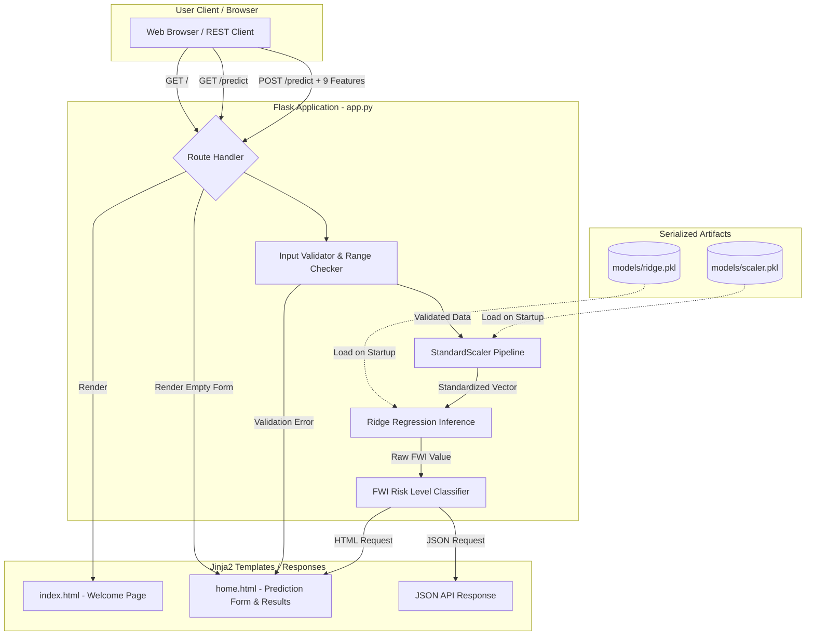
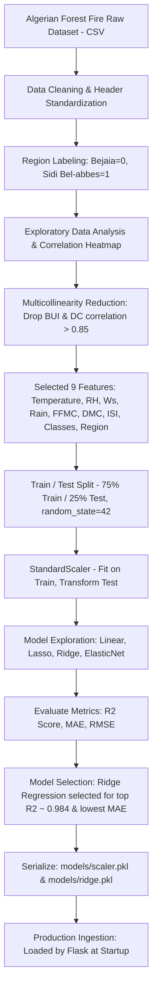

# System Architecture & Machine Learning Workflow

This document details the system design, request lifecycle, machine learning pipeline, and algorithmic rationale behind the **Algerian Forest Fire Weather Index (FWI) Predictor**.

---

## 1. Request Flow Architecture

The web application is powered by a Flask backend that serves both user-facing HTML templates and REST API endpoints. Models are loaded into memory once upon application initialization for low-latency inference.

---

## 2. Machine Learning Training Pipeline

The offline training workflow processes raw meteorological and fire observation records, cleans noise and structural anomalies, scales continuous features, and tests multiple regularized regression algorithms.

---

## 3. Why Ridge Regression?

During model exploration across multiple candidate algorithms (Ordinary Least Squares Linear Regression, Lasso, Ridge, and ElasticNet), **Ridge Regression (L2 Regularization)** was selected as the production model for several reasons:

1. **Multicollinearity Management**: The Canadian Forest Fire Weather Index (FWI) system features interrelated indicators (such as FFMC, DMC, and ISI). Ordinary Least Squares is vulnerable to inflated variance when collinearity exists among meteorological features.
2. **Smooth Coefficient Shrinkage vs. Feature Elimination**: While Lasso (L1 Regularization) forces feature coefficients to absolute zero, in this domain, subtle signals from relative humidity, wind speed, and fuel moisture indices all contribute predictive power. Setting coefficients to zero discarded informative variance and reduced test accuracy.
3. **Generalization Performance**: Ridge regression applies quadratic shrinkage on model weights ($\|\beta\|_2^2$), constraining coefficient magnitude without eliminating predictors. This balance produced the highest test coefficient of determination ($R^2 \approx 0.9843$) and the lowest Mean Absolute Error ($\text{MAE} \approx 0.5642$) on unseen validation data.
