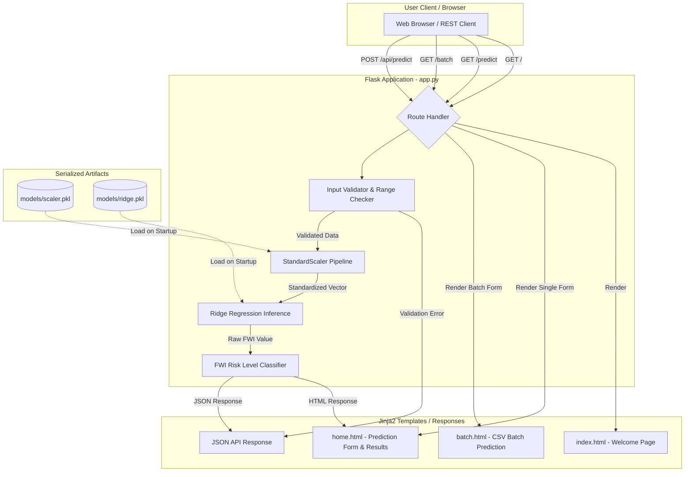
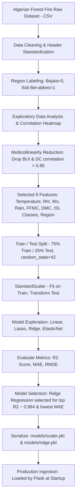

# 🔥 Algerian Forest Fire Weather Index (FWI) Predictor

[](https://github.com/Katakam-Krupavathi/Forest_Fire/actions/workflows/ci.yml)
[](https://www.python.org/)
[](LICENSE)
[](tests/)

An end-to-end Machine Learning web application and REST API that predicts the **Forest Fire Weather Index (FWI)** using meteorological observations from the **Algerian Forest Fire Dataset**.

---

## 🚀 Key Features

- **Trained Machine Learning Model**: Ridge Regression pipeline with StandardScaler trained on curated meteorological data ($R^2 \approx 0.9843$, $\text{MAE} \approx 0.5642$).
- **Flask Web Application**: Clean, responsive interface built with Bootstrap 5 and Chart.js.
- **Batch CSV Upload (`/batch`)**: Bulk prediction page with tabular result previews, sample template download, and CSV export.
- **Feature Explainability**: Visual bar breakdown illustrating how individual standardized features drive the FWI prediction higher or lower.
- **JSON REST API (`POST /api/predict`, `GET /health`)**: Programmatic endpoints returning prediction results, danger ratings, and feature contributions.
- **Session Prediction History**: Interactive Chart.js trend line tracking predictions across the current session.
- **Standardized Fire Danger Classification**: Categorizes raw FWI numbers into Canadian Forest Fire Danger rating bands (*Low, Moderate, High, Very High, Extreme*).
- **Containerized Deployment**: Pre-configured `Dockerfile` and `docker-compose.yml` for reproducible local or cloud execution.
- **Automated CI/CD**: Automated GitHub Actions workflow testing on Python 3.10, 3.11, and 3.12 with 15 unit tests.

---

## 🛠️ Tech Stack

- **Language**: Python 3.10+
- **Machine Learning**: Scikit-Learn, NumPy, Pandas
- **Web Framework**: Flask, Gunicorn
- **Frontend & Visualizations**: HTML5, CSS3, Bootstrap 5, Chart.js
- **Containerization**: Docker, Docker Compose
- **Testing & CI**: Pytest, GitHub Actions
- **Deployment**: AWS Elastic Beanstalk / Render / Railway / Docker VPS

---

## 📊 Feature Parameters & Risk Levels

### Input Parameters
| Parameter | Name | Description | Valid Range |
| :--- | :--- | :--- | :--- |
| **Temperature** | `Temperature` | Ambient temperature in Celsius | -10°C to 60°C |
| **Relative Humidity** | `RH` | Relative humidity percentage | 0% to 100% |
| **Wind Speed** | `Ws` | Wind speed in km/h | 0 to 100 km/h |
| **Rainfall** | `Rain` | 24-hour total rainfall in mm | $\ge 0$ mm |
| **FFMC** | `FFMC` | Fine Fuel Moisture Code index | 0 to 105 |
| **DMC** | `DMC` | Duff Moisture Code index | $\ge 0$ |
| **ISI** | `ISI` | Initial Spread Index | $\ge 0$ |
| **Classes** | `Classes` | Fire occurrence status | `0` (Not Fire), `1` (Fire) |
| **Region** | `Region` | Geographic study area | `0` (Bejaia), `1` (Sidi Bel-abbes) |

### Fire Weather Index (FWI) Danger Bands
| FWI Index Value | Danger Level | Badge Color | Description |
| :--- | :--- | :--- | :--- |
| **$< 5.2$** | `Low` | 🟢 Green | Fire potential is minimal |
| **$5.2 - 11.2$** | `Moderate` | 🔵 Blue | Controlled fires possible |
| **$11.2 - 21.3$** | `High` | 🟡 Yellow | Wildfires spread readily |
| **$21.3 - 38.0$** | `Very High` | 🔴 Red | Fast spreading, difficult to suppress |
| **$\ge 38.0$** | `Extreme` | ⚫ Dark | Severe, highly explosive fire risk |

---

## 🏗️ Architecture & ML Pipeline

### 1. Request Flow Architecture
The web application is powered by a Flask backend (`app.py`) that serves both user-facing HTML templates and REST API endpoints. Serialized models and scalers are loaded into memory once upon startup for high-performance, low-latency inference.



### 2. Machine Learning Training Pipeline
The offline training workflow cleans raw meteorological observations, merges regional records, reduces multicollinearity, scales continuous features, and tests multiple regularized regression algorithms:



### 3. Why Ridge Regression?
During model exploration across candidate algorithms (Ordinary Least Squares Linear Regression, Lasso, Ridge, and ElasticNet), **Ridge Regression ($L_2$ Regularization)** was selected for several key reasons:

1. **Multicollinearity Management**: Meteorological indicators (FFMC, DMC, and ISI) have strong mutual correlation. Ordinary Least Squares is prone to inflated parameter variance when collinearity is present.
2. **Smooth Coefficient Shrinkage vs. Feature Elimination**: While Lasso ($L_1$ Regularization) forces coefficients strictly to zero, continuous meteorological variations (relative humidity, wind speed, moisture codes) all provide valuable predictive signals. Discarding features led to higher prediction error.
3. **Generalization Performance**: Ridge regression applies quadratic shrinkage on model weights ($\|\beta\|_2^2$), penalizing large coefficients without removing informative features. It achieved the highest test determination score ($R^2 \approx 0.9843$) and lowest Mean Absolute Error ($\text{MAE} \approx 0.5642$) on unseen validation data.

---

## 📂 Run Locally

### 1. Clone the Repository
```bash
git clone https://github.com/Katakam-Krupavathi/Forest_Fire.git
cd Forest_Fire
```

### 2. Set Up Virtual Environment & Dependencies
```bash
python -m venv venv
# On Windows:
venv\Scripts\activate
# On macOS/Linux:
source venv/bin/activate

pip install -r requirements.txt
```

### 3. Run Unit Tests
```bash
pytest tests/
```

### 4. Retrain Model (Optional)
```bash
python scripts/train.py
```

### 5. Start the Application
```bash
python app.py
```
Open your browser and navigate to `http://127.0.0.1:5000/`.

---

## 🐳 Docker Deployment

### Run with Docker Compose
```bash
docker compose up --build
```
The app will be accessible at `http://localhost:5000`.

---

## 🌐 API Documentation

### 1. Health Check (`GET /health`)
```bash
curl -X GET http://127.0.0.1:5000/health
```
**Response:**
```json
{
  "status": "healthy",
  "model_loaded": true
}
```

### 2. Predict FWI (`POST /api/predict`)
```bash
curl -X POST http://127.0.0.1:5000/api/predict \
  -H "Content-Type: application/json" \
  -d '{
    "Temperature": 32.0,
    "RH": 55.0,
    "Ws": 16.0,
    "Rain": 0.0,
    "FFMC": 88.5,
    "DMC": 18.2,
    "ISI": 6.8,
    "Classes": 1,
    "Region": 0
  }'
```
**Response:**
```json
{
  "status": "success",
  "fwi": 11.24,
  "risk_level": "High",
  "risk_class": "warning",
  "inputs": {
    "Temperature": 32.0,
    "RH": 55.0,
    "Ws": 16.0,
    "Rain": 0.0,
    "FFMC": 88.5,
    "DMC": 18.2,
    "ISI": 6.8,
    "Classes": 1,
    "Region": 0
  },
  "feature_contributions": [
    { "feature": "FFMC", "weight": 4.12, "contribution": 3.84, "impact": "Increases Risk" },
    { "feature": "ISI", "weight": 2.95, "contribution": 2.11, "impact": "Increases Risk" },
    { "feature": "RH", "weight": -1.82, "contribution": -1.45, "impact": "Decreases Risk" }
  ]
}
```

---

## ☁️ Cloud Deployment

### 1. AWS Elastic Beanstalk
The repository includes `.ebextensions/python.config` configured for WSGI deployment:
```yaml
option_settings:
    "aws:elasticbeanstalk:container:python":
        WSGIPath: app:app
```

### 2. Production WSGI (Render / Railway / VPS)
To deploy on PaaS providers, configure the start command:
```bash
gunicorn app:app --bind 0.0.0.0:$PORT
```
